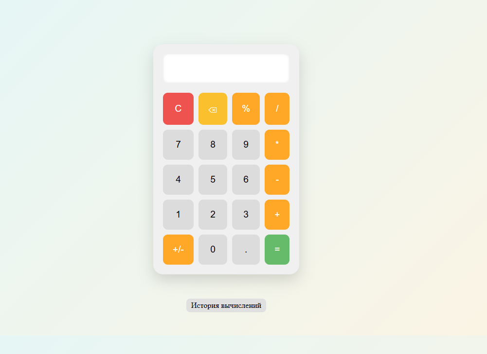
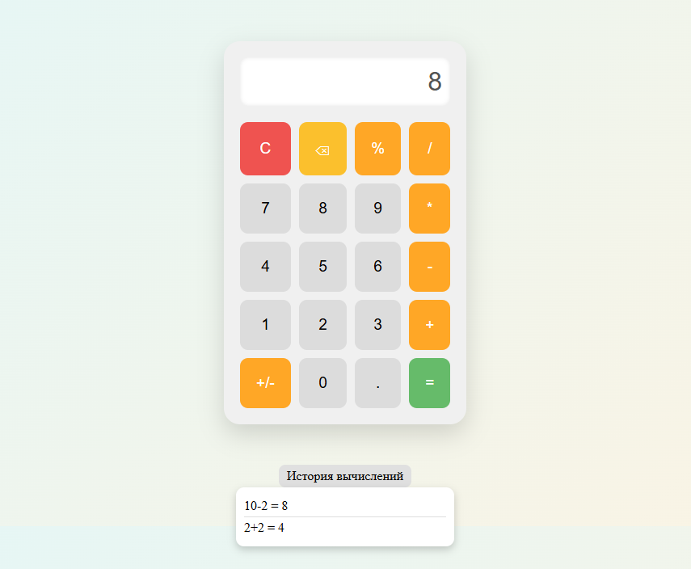

# Калькулятор на HTML/CSS/JavaScript

Проект представляет собой простой функциональный калькулятор, реализованный с использованием **HTML**, **CSS** и **Vanilla JavaScript**. Интерфейс адаптирован под десктоп и включает в себя историю вычислений, поддержку клавиатуры и базовые арифметические операции.

## Оглавление

- [Функциональность](#функциональность)
- [Структура проекта](#структура-проекта)
- [Запуск](#как-запустить)
- [Горячие клавиши](#горячие-клавиши)
- [Скриншоты](#скриншоты)
- [Автор](#автор)

## Функциональность

- Стандартные операции: сложение, вычитание, умножение, деление.
- Дополнительные функции: процент, смена знака (+/-), очистка (C), удаление символа (⌫).
- История вычислений (до 10 последних выражений).
- Поддержка ввода с клавиатуры.
- Автокоррекция ведущих нулей и длинных чисел.
- Приятный интерфейс.

## Структура проекта

├── screens          # Папка со скриншотами  
├── index.html       # Основная HTML-страница  
├── style.css        # Стилизация калькулятора  
├── script.js        # Логика и обработка ввода  
└── README.md        # Документация проекта

## Как запустить

1. Скачайте или клонируйте репозиторий:

   ```
   git clone https://github.com/Ars2805/calculator.git
   ```

2. Откройте файл index.html в браузере.

## Горячие клавиши

- Цифры и операторы: 0–9, +, -, *, /, .
- Enter: Посчитать (=)
- Backspace: Удалить символ (⌫)
- Escape: Очистить (C)
- %: Вычислить процент

## Скриншоты




## Автор

- [Арсения Лушина](https://github.com/Ars2805)